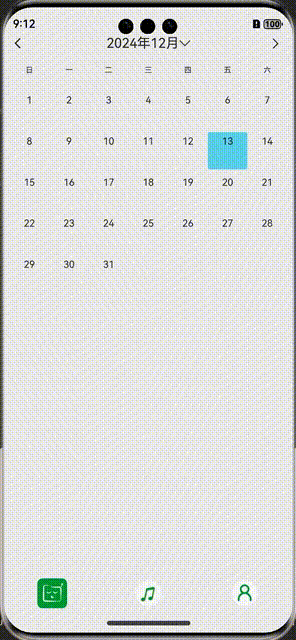

# Part 9: Custom Swipeable Calendar Component

> Example effect:



In HarmonyOS app development, a calendar component is fundamental for many scenarios such as check-in, booking, and schedule management. Although ArkTS does not provide a built-in full-featured calendar component, you can use basic components like `Swiper` and `ForEach` to create a high-performance, horizontally swipeable custom calendar. This article details the implementation ideas, core code, and best practices. All APIs and terminology refer to the [Huawei Developer Official Documentation](https://developer.huawei.com/consumer/en/doc/harmonyos-guides-V5/arkts-ui-components-V5).

## 1. Implementation Ideas and Key Points

1. Use the `Swiper` component to load 3 months of calendars (previous, current, next) managed by the `showDates` array.
2. Initially display the middle page (i.e., index=1), and set `.loop(true)` for infinite swiping.
3. After swiping (`onChange`), only update the data for the left and right months to avoid full UI refresh and improve performance.
4. Both the calendar header and content are rendered dynamically with `ForEach`, supporting custom styles and click events.

## 2. Core Code Example

```ts
@Local showDates: Date[] = [dateHelper.lastMoth(), new Date(), dateHelper.nextMoth()]; // Previous, current, next month
@Local selectData: Date = new Date(); // Currently selected date
private showIndex: number = 1; // Default swipe index

Swiper() {
    ForEach(this.showDates, (item: Date) => {
      this.monthView(item)
    })
  }
  .index(1)
  .loop(true)
  .indicator(false)
  .onChange((index: number) => {
    let cur = this.showDates[index];
    this.showIndex = index;
    this.changeCalender(cur);
  })
```

## 3. Complete Component Structure

- Year/month switching, jump to current month, left/right arrows, date selection, calendar header, and calendar content are all customizable.
- The `dateHelper` utility generates a two-dimensional array for the calendar, supporting placeholders and same-day checks.

## 4. Best Practices and Official Documentation

- Recommended reading: [ArkTS UI Components Official Documentation](https://developer.huawei.com/consumer/en/doc/harmonyos-guides-V5/arkts-ui-components-V5) and [ArkTS Coding Style Guide](https://developer.huawei.com/consumer/en/doc/harmonyos-guides-V5/arkts-coding-style-guide-V5).
- It is recommended to encapsulate the calendar as an independent component for reuse and maintenance.
- When swiping, only update necessary data to avoid full refresh.
- Code should include detailed comments, and key exceptions should be logged for troubleshooting.

----

**All content for this chapter is complete! The full source code has been uploaded to Gitee: [HarmonyOS App 0-1 Development](https://gitee.com/qincji/ZeroOneApp).** 