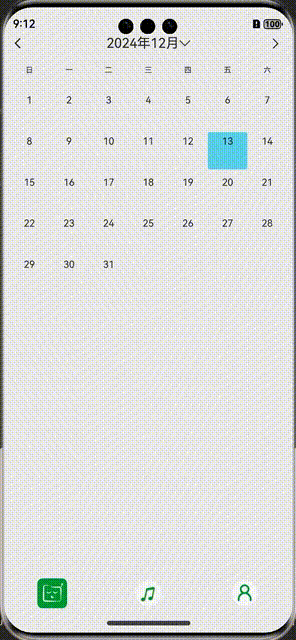

# 第9篇：自定义可左右滑动的日历控件

> 效果图如下



在鸿蒙应用开发中，日历控件是许多场景（如打卡、预约、日程管理等）的基础组件。ArkTS虽然没有内置完整的日历组件，但我们可以通过`Swiper`、`ForEach`等基础组件自定义实现高性能、可左右滑动的日历控件。本文将详细讲解实现思路、核心代码和最佳实践，所有API和术语均参考[华为开发者官网](https://developer.huawei.com/consumer/cn/doc/harmonyos-guides-V5/arkts-ui-components-V5)。

## 一、实现思路与关键点

1. 使用`Swiper`组件加载3个月的日历（上月、当月、下月），通过`showDates`数组管理。
2. 初始显示中间一页（即index=1），并设置`.loop(true)`实现循环滑动。
3. 滑动结束后（`onChange`），只更新左右两侧的月份数据，避免UI整体刷新，提升性能。
4. 日历表头、内容均用`ForEach`动态渲染，支持自定义样式和点击事件。

## 二、核心代码示例

```ts
/*
 * @Desc: 
 * @Author: qincji
 * @Date: 2024/11/18
 */
import { global } from 'common_utils/src/main/ets/core/Global';
import { dateHelper } from './DateHelper';
import { curves } from '@kit.ArkUI';

@ComponentV2
export struct CalendarView {
  @Event onSelected?: (newDate: Date, oldDate?: Date) => void;
  @Local showDates: Date[] = [dateHelper.lastMoth(), new Date(), dateHelper.nextMoth()];
  @Local selectData: Date = new Date();
  @BuilderParam dayView?: (show: Date) => void;
  private showIndex: number = 1;

  aboutToAppear(): void {
    this.onSelected?.(this.selectData);
  }

  build() {
    Column({ space: 10 }) {
      RelativeContainer() {
        Image($r("app.media.ic_back"))
          .height(40)
          .padding(10)
          .aspectRatio(1)
          .id('last')
          .alignRules({ left: { 'anchor': '__container__', 'align': HorizontalAlign.Start } })
          .onClick(() => {
            this.changeCalender(dateHelper.lastMoth(this.selectData));
          });

        Row() {
          Text(`${this.selectData.getFullYear()}年${this.selectData.getMonth() + 1}月`)
            .fontSize(18)
            .textAlign(TextAlign.Center)
          Image($r("app.media.ic_down"))
            .width(12)
            .aspectRatio(1)
        }
        .id('select')
        .alignRules({
          middle: { 'anchor': '__container__', 'align': HorizontalAlign.Center },
          center: { 'anchor': '__container__', 'align': VerticalAlign.Center }
        })
        .onClick(() => {
          this.getUIContext().showDatePickerDialog({
            selected: this.selectData,
            onDateAccept: (value: Date) => {
              this.changeCalender(value);
            },
          })
        });

        if (!this.isCurMonth()) {
          Text('now')
            .fontSize(12)
            .fontColor(Color.White)
            .backgroundColor($r('app.color.theme_2'))
            .borderRadius(2)
            .padding({ left: 5, right: 5 })
            .margin({ left: 5 })
            .id('now')
            .alignRules({
              left: { 'anchor': 'select', 'align': HorizontalAlign.End },
              center: { 'anchor': '__container__', 'align': VerticalAlign.Center }
            })
            .onClick(() => {
              this.changeCalender(new Date());
            });
        }


        Image($r("app.media.ic_arrow"))
          .width(40)
          .aspectRatio(1)
          .padding(10)
          .id('next')
          .alignRules({ right: { 'anchor': '__container__', 'align': HorizontalAlign.End } })
          .onClick(() => {
            this.changeCalender(dateHelper.nextMoth(this.selectData));
          });
      }
      .height(40)
      .width('100%')

      
      Row() {
        ForEach(["日", "一", "二", "三", "四", "五", "六"], (day: string) => {
          Text(day)
            .width('14%')
            .fontColor('#333333')
            .fontSize(10)
            .textAlign(TextAlign.Center);
        });
      }
      .margin({ bottom: 12 })
      .justifyContent(FlexAlign.SpaceBetween)
      
      Swiper() {
        ForEach(this.showDates, (item: Date) => {
          this.monthView(item)
        })
      }
      .width('100%')
      .height('auto')
      .cachedCount(3)
      .index(1)
      .autoPlay(false)
      .loop(true)
      .itemSpace(0)
      .vertical(false)
      .displayArrow(false, false)
      .indicator(false) 
      .onChange((index: number) => {
        let cur = this.showDates[index];
        this.showIndex = index;
        this.changeCalender(cur);
      })
    }
    .padding({ left: '1%', right: '1%' }) 
  }

  private changeCalender(newDate: Date) {
    this.showDates[this.showIndex] = newDate;
    if (this.showIndex === 0) {
      this.showDates[1] = dateHelper.nextMoth(newDate);
      this.showDates[2] = dateHelper.lastMoth(newDate);
    } else if (this.showIndex === 1) {
      this.showDates[0] = dateHelper.lastMoth(newDate);
      this.showDates[2] = dateHelper.nextMoth(newDate);
    } else { //this.showIndex === 2
      this.showDates[1] = dateHelper.lastMoth(newDate);
      this.showDates[0] = dateHelper.nextMoth(newDate);
    }
    this.onSelected?.(newDate, this.selectData);
    this.selectData = newDate;
  }

  @Builder
  monthView(date: Date) {
    Column({ space: 5 }) {
      ForEach(dateHelper.buildCalendar(date), (week: number[]) => {
        Row() {
          ForEach(week, (day: number) => {
            Stack() {
              if (typeof day === 'number') {
                if (this.dayView === undefined) {
                  Column() {
                    Text(`${day}`)
                      .fontColor('#333333')
                      .fontSize(13)
                      .textAlign(TextAlign.Center)
                      .margin({ top: 5 })
                  }
                  .width('100%')
                  .height('100%')
                  .backgroundColor(this.selectDayColor(date, day))
                  .borderRadius(3)
                } else {
                  this.dayView(new Date(date.getFullYear(), date.getMonth(), day));
                }
              }
            }
            .width('14%')
            .height('100%')
            .padding({left: '1%', right: '1%'})
            .scale(this.getScale(date, day))
            .animation({
              duration: 500,
              curve: Curve.EaseOut,
              iterations: 1,
              playMode: PlayMode.Normal
            })
            .onClick(global.blockQuickClick(() => {
              if (typeof day === 'number') {
                const newDate = new Date(date.getFullYear(), date.getMonth(), day);
                this.onSelected?.(newDate, this.selectData);
                this.selectData = newDate;
                // this.startAnimal();
              }
            }))
          })
        }
        .height(50)
        .justifyContent(FlexAlign.SpaceBetween)
      });
    }
    .transition(TransitionEffect.IDENTITY.combine(TransitionEffect.scale({ x: 2, y: 2 })
      .combine(TransitionEffect.move(TransitionEdge.TOP))
      .animation({ curve: curves.springMotion() })))
  }

  getScale(date: Date, day: number): ScaleOptions {
    if (typeof day === 'number'){
      date = new Date(date.getFullYear(), date.getMonth(), day)
      if (dateHelper.isOneDay(date, this.selectData)) {
        return { x: 1.1, y: 1.1 };
      }
    }

    return { x: 1, y: 1 };
  }

  startAnimal() {
    animateTo({
      duration: 10, onFinish: () => {
      }
    }, () => {
    })
  }

  isCurMonth(): boolean {
    const cur = new Date();
    if (cur.getFullYear() !== this.selectData.getFullYear()) {
      return false;
    }
    if (cur.getMonth() !== this.selectData.getMonth()) {
      return false;
    }
    return true;
  }

  selectDayColor(date: Date, day: number) {
    return dateHelper.isOneDay(this.selectData, new Date(date.getFullYear(), date.getMonth(), day))
      ? '#ff8cdaf1' : Color.Transparent
  }
}
```

## 三、完整组件结构

- 年月切换、跳转本月、左右箭头、日期选择、日历表头、日历内容均支持自定义。
- 通过`dateHelper`工具类生成月历二维数组，支持补位、判断同一天等。

## 四、最佳实践与官方文档

- 推荐阅读[ArkTS UI组件官方文档](https://developer.huawei.com/consumer/cn/doc/harmonyos-guides-V5/arkts-ui-components-V5)和[ArkTS编程规范](https://developer.huawei.com/consumer/cn/doc/harmonyos-guides-V5/arkts-coding-style-guide-V5)。
- 日历控件建议封装为独立组件，便于复用和维护。
- 滑动切换建议只更新必要数据，避免全量刷新。
- 代码应有详细注释，关键异常需日志记录，便于排查。

----

**到这里，所有的内容已经结束了！本章的完整源码已经上传到gitee了：[鸿蒙应用0-1开发](https://gitee.com/qincji/ZeroOneApp)。**